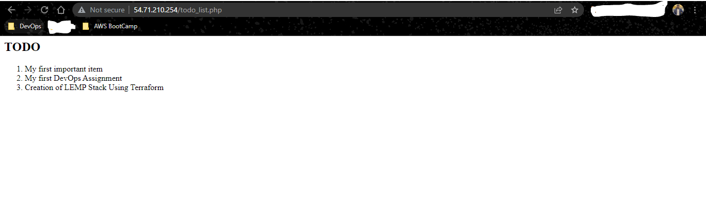

## WEB STACK IMPLEMENTATION (LEMP STACK) USING TERRAFORM
LEMP stack is an open-source web application stack used to develop web applications. The term LEMP is an acronym that represents L for the Linux Operating system, Nginx (pronounced as engine-x) web server, M for MySQL database, and P for PHP scripting language.

This project uses terraform to provision the infrastrcuture required for this project.

### Requirements for this project are:
- An AWS account
- A Laptop
- Good Internet Connection

Every other requirements and configuration for this project is provisioned using terraform - an IaC tool which enables provides automation and code reuseablilty.

We intend to acheieve the below listed activities/tasks:
-   INSTALLING THE NGINX WEB SERVER
-   INSTALLING MYSQL
-   INSTALLING PHP
-   CONFIGURING NGINX TO USE PHP PROCESSOR
-   TESTING PHP WITH NGINX
-   RETRIEVING DATA FROM MYSQL DATABASE WITH PHP
-   TESTING OUR NEW PROJECT

Steps one(1) to three will be achieved using the provisioner module within terraform. Hence, this write up will be focused on step five(5) to seven(7).

## Prequisite Step
- Clone the repo
- Open the main.tf file (Make adjustment where necessary e.g. Key Pair Name, Tags etc)
- Open your preferred cli (My prefered cli tool for windows is Git Bash)
- export your aws profile (If you have multiple profiles like)
```
export AWS_PROFILE="profile name"
```
- Initialise the project - Terraform initializes the working directory containing the configuration file and install the necessary plugins 
```
terraform init
```


- Plan the project - This provodes a summary of the changes about to be effected into your AWS account
```
terraform plan
```


- After you confirm the planned changes, apply the configuration into your account
```
terraform apply -auto-approve
```


Once the above step is completed, terraform runs the script and provides an output of the public and private ip address of the newly created EC2 instance running an Ubuntu Operating System.
Next step is to ssh into the ec2 instance using the public ip from the output and the private key that will now be downloaded to your working directory.

You can confirm that the ec2 instance is running via the aws console (GUI) and also confirm the public ip address


```
ssh -i "name of your key pair" "user"@"your public ip address"
ssh ubuntu@"public ip address"
```


Now you have remotely connected into your instance, you need to carry out a few configurations.
# Nginx
Type in the following commands to confirm the status of your nginx server

```
sudo systemctl status nginx
curl http://localhost:80
```


Now, the nginx server is accessible via your publiic ip address, Open your prefered browser and type in

```
"your public ip address":80
```


We can now confirm that the Nginx server is Up.

# MySql
Type in the below command to login to the mysql enviroment and test your installation

```
sudo mysql
```


In the Mysql enviroment, One of the first thing to do after installing mysql server is to run a security script to remove insecure default settings and lock down access to our database system. Use the following command. You can specify your prefered password in the password phase

```
ALTER USER 'root'@'localhost' IDENTIFIED WITH mysql_native_password BY 'password';
```


Now exit the Mysql enviroment by typing "exit". The next step is to setup an interactive scripting plugin to validate our passwords.

```
sudo mysql_secure_installation
```


The above command will respond with an interactive session where you have to decide if you want to retain the password your created earlier or change to another one. Once done, progress to the next step which is to test login access to your mysql using your password.
```
sudo mysql -p
```


once you type the above command, input your password and type enter. Then exit mysql.

## CONFIGURING NGINX TO USE PHP PROCESSOR
Now that you can confirm all requiremnts installed and configured. We need to configure Nginx to use Php.
Now create the root web directory for your "domain"
```
sudo mkdir /var/www/LEMP
```
Next step is to change ownership of the created directory to the $USER
```
sudo chown -R $USER:$USER /var/www/LEMP
```
Once done, create and open a new configuration file in Nginx's directory using your prefered editor (Nano or Vim). I'll be using nano
```
sudo nano /etc/nginx/sites-available/LEMP
```
This is create a blank file in editor mode, copy and paste the below configurations into the created file.
```
server {
    listen 80;
    server_name LEMP www.LEMP;
    root /var/www/LEMP;

    index index.html index.htm index.php;

    location / {
        try_files $uri $uri/ =404;
    }

    location ~ \.php$ {
        include snippets/fastcgi-php.conf;
        fastcgi_pass unix:/var/run/php/php8.1-fpm.sock;
     }

    location ~ /\.ht {
        deny all;
    }
}
```


Once you paste the copied configuration to the created file, use Ctrl+X and Y to exit and save the configuration.

Next step is to activate your new configuration by linking it to the configuration file in the Nginx directory
```
sudo ln -s /etc/nginx/sites-available/LEMP /etc/nginx/sites-enabled/
```
Once the above is done, you need to test your configuration for syntx error 
```
sudo nginx -t
```


Next step is to diable the default Nginx host configured and currently listening on port 80 as we need our new configuration to be accessible through port 80
```
sudo unlink /etc/nginx/sites-enabled/default
```

Your weebsite iw now active but empty, Now we need to create an index.html file and include some configuration
```
sudo echo 'Hello, My name is Emmanuel Oyebamiji, I am a DevOps Intern at SymIOT Limited, This is one of my DevOps project, Creating of a LEMP Stack using terraform. Here is my host name' $(curl -s http://169.254.169.254/latest/meta-data/public-hostname) 'with public IP' $(curl -s http://169.254.169.254/latest/meta-data/public-ipv4) > /var/www/LEMP/index.html
```
You can edit the content to what you like. 

Now our website up and running with content and is accessible via
```
"Your public ip address":80
```


## TESTING PHP WITH NGINX
After completing the above steps, we are half way done with this project.
Next step is to test our php configuration with our Nginx server.

Now you need to create a new file in the /var/www/LEMP directory using your favourtite editor (Nano or Vim)
```
sudo nano /var/www/LEMP/info.php
```
Next step is to provide content into the created file, now copy the below configuration and past into the file
```
<?php
phpinfo();
```

Now our Php information page is now accessible from the below url
```
"Your public ip address"/info.php
```


Now we have tested the connection between our Php and Nginx, we need to delete the new file we created above as it contains sensitive informations about our php environment. Security is on of the key factors in DevOps, as such we should carry out best security practices in our projects.

## RETRIEVING DATA FROM MYSQL DATABASE WITH PHP

The goal in this step is to create a test database (DB) with simple "To do list" and configure access to it, so the Nginx website would be able to query data from the DB and display it. 
As such, I created a database called 'emmanuel_database' and a user called 'emmanuel_user'.

Next step is to connect back to your Mysql login and create a database and user

Login using
```
sudo mysql -p
```


In the mysql terminal, create a database using
```
CREATE DATABASE
emmanuel_database
;
```

Next step is to create a new user and grant him full privileges on the database. And grant the user priviledges to the database

```
CREATE USER 'emmanuel_user'@'%' IDENTIFIED WITH mysql_native_password BY 'PassWord1@';
GRANT ALL ON emmanuel_database TO 'emmanuel_user'@'%';
```

Now exit the mysql terminal and re-login to the mysql terminal using the uer id and password you have just created
```
mysql -u emmanuel_user -p "pasword"
```

Once you have re-login to the mysql terminal, next step is to create a table in the database created called "To-DO List"
```
CREATE TABLE emmanuel_database.todo_list (
item_id INT AUTO_INCREMENT,
content VARCHAR(255),
PRIMARY KEY(item_id)
);
```
Next step is to populate the table with some few details, using
```
INSERT INTO emmanuel_database.todo_list (content) VALUES ("My first important item");
INSERT INTO emmanuel_database.todo_list (content) VALUES ("My first DevOps Assignment");
INSERT INTO emmanuel_database.todo_list (content) VALUES ("Creation of LEMP Stack Using Terraform");
```

Next step is confirm the successful inclusion of the created details in the database table, using

```
SELECT * FROM emmanuel_database.todo_list;
```

next step is to exit the mysql terminal and create a new php file in your custom root directory using your prefered editor (Nano or Vim)
```
nano /var/www/LEMP/todo_list.php
```
Next step is to paste the below code into the created file and save it
```
<?php
$user = "emmanuel_user";
$password = "PassWord1@";
$database = "emmanuel_database";
$table = "todo_list";

try {
  $db = new PDO("mysql:host=localhost;dbname=$database", $user, $password);
  echo "<h2>TODO</h2><ol>";
  foreach($db->query("SELECT content FROM $table") as $row) {
    echo "<li>" . $row['content'] . "</li>";
  }
  echo "</ol>";
} catch (PDOException $e) {
    print "Error!: " . $e->getMessage() . "<br/>";
    die();
}
```

Once the above is done, navigate to your preferred web browser and open your newly created table uisng
```
"your public ip"/todo_list.php
```



Here marks the end of our project as we have been able to achieve the task at hand.

Please Feel free to clone this repo and pull a request should you have any improvement to this project. 

Thank you.